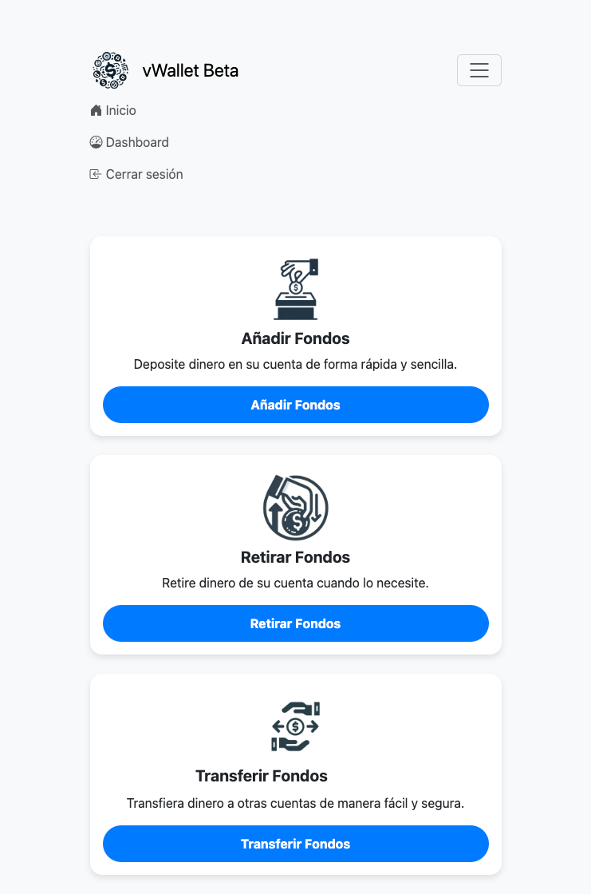
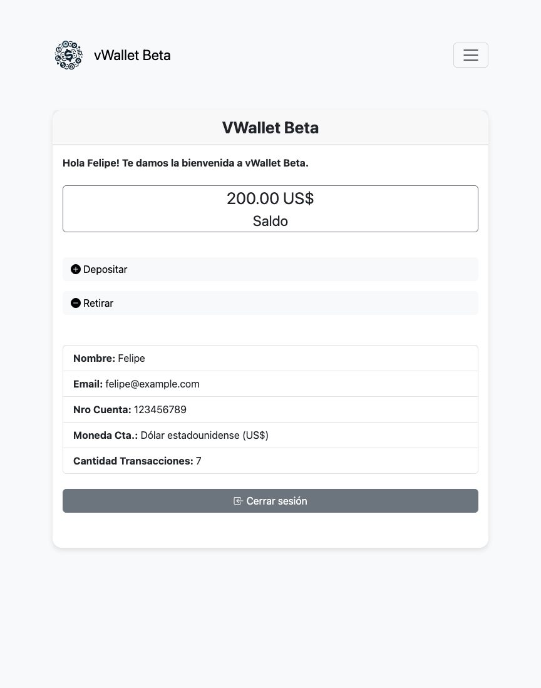

# 💸 vWallet Beta
vWallet Beta es una simple aplicación escrita con Java e interfaz web usando JSP que permite, por ahora, realizar las siguientes operaciones:

✅ Done:
- Iniciar sesión / cerrar sesión
- Ver datos de la cuenta (Saldo, número, etc)
- Realizar depósitos
- Realizar retiros

🔜 Por hacer:
- Transferencias entre cuentas
- Historial de transacciones
- Cambio de contraseña
- Manejar contactos
- Realizar compras en línea

## 📋 Requisitos
- Java versión 19 o superior
- Apache Tomcat 10.1.19
- MariaDb 11.3.2 o MySQL similar en compatibilidad.
- Proyecto construido con IntelliJ IDEA.

## ⚙️ Dependencias del proyecto
- [jakarta.servlet-api-6.1.0-M2.jar](src/main/webapp/WEB-INF/lib/jakarta.servlet-api-6.1.0-M2.jar)
- [jbcrypt-0.4.jar](src/main/webapp/WEB-INF/lib/jbcrypt-0.4.jar)
- [mariadb-java-client-3.4.0.jar](src/main/webapp/WEB-INF/lib/mariadb-java-client-3.4.0.jar)

## 👨‍💻 Usuarios de prueba
La aplicación tiene el usuario felipe@example.com como valor por defecto en el formulario de Login, solo basta presionar el botón de ingresar.
La diferencia entre usuarios es más que nada el saldo y tipo de moneda usada.

| Usuario            | Contraseña |
|--------------------|------------|
| felipe@example.com | 123456     |
| maria@example.com  | 123456     |
| pedro@example.com  | 123123     |

## 📸 Capturas de pantalla

